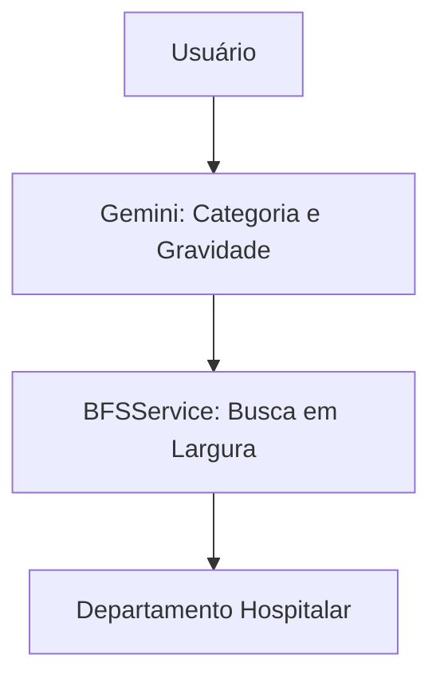

# 🏥 Sistema Inteligente de Triagem Hospitalar (Gemini + BFS)

## 📘 Visão Geral
Este projeto combina **IA (Gemini)** e **algoritmos de busca (BFS)** para simular um sistema de triagem hospitalar inteligente.
O sistema analisa os sintomas do paciente e direciona-o automaticamente ao departamento mais adequado.

---

## ⚙️ Tecnologias Usadas
- **Laravel 11** – Backend e API REST
- **Gemini API (Google AI)** – Processamento de linguagem natural
- **Busca em Largura (BFS)** – Decisão do setor interno
- **MySQL** – Base de dados relacional
- **Postman / Axios** – Testes e consumo da API

---

## 🧠 Funcionamento Geral
1. O utilizador insere sintomas via endpoint `/gemini/interpretar`.
2. A API Gemini devolve `{categoria, gravidade}`.
3. O agente interno (`BFSService`) percorre os nodos de triagem hospitalar com base nas regras de decisão.
4. O sistema retorna o departamento recomendado.

---

## 📚 Estrutura do Projeto
```
app/
 ├── Http/Controllers/
 │   ├── GeminiController.php
 │   └── TriagemController.php
 ├── Models/
 │   ├── Departamento.php
 │   └── NodoTriagem.php
 ├── Services/
 │   └── BFSService.php
database/
 ├── migrations/
 ├── seeders/
 │   ├── DepartamentoSeeder.php
 │   └── NodoTriagemSeeder.php
routes/
 └── api.php
```

---

## 🧩 Exemplo de Dados

### 🏥 Tabela: `departamentos`
| id | nome          | descricao           |
|----|----------------|--------------------|
| 1  | Emergência     | Casos críticos     |
| 2  | Clínica Geral  | Casos leves        |
| 3  | Pediatria      | Crianças           |
| 4  | Cardiologia    | Problemas cardíacos|

### 🔗 Tabela: `nodos_triagem`
| id | pergunta               | sim | nao | departamento_id |
|----|------------------------|-----|-----|----------------|
| 1  | Febre alta?            | 2   | 3   | null           |
| 2  | Dificuldade respiratória?|null|null| 1              |
| 3  | Criança?               |null|null| 3              |

Os valores nas colunas `sim` e `nao` indicam o **ID do próximo nodo**.
- Exemplo: o nodo 1 tem `sim=2`, `nao=3`.  
  Se o paciente tiver febre alta, segue para o nodo 2; caso contrário, para o nodo 3.

---

## 📡 API Documentation

### 1️⃣ `/gemini/interpretar` – Interpretação de Sintomas
**Método:** POST  
**Descrição:** Envia texto de sintomas e retorna categoria e gravidade.

#### Request
```json
{
  "texto": "Tenho febre alta e dificuldade para respirar"
}
```

#### Response
```json
{
  "categoria": "respiratória",
  "gravidade": "alta"
}
```

---

### 2️⃣ `/triagem/automatica` – Decisão do Departamento
**Método:** POST  
**Descrição:** Usa os resultados do Gemini e executa o BFS interno para determinar o departamento.

#### Request
```json
{
  "categoria": "respiratória",
  "gravidade": "alta"
}
```

#### Response
```json
{
  "categoria": "respiratória",
  "gravidade": "alta",
  "departamento": "Emergência"
}
```

---

## 🧮 Fluxo Resumido


---

## 🔍 PEAS
| Elemento | Descrição |
|-----------|------------|
| **P** | Correta classificação de sintomas e decisão rápida |
| **E** | Ambiente hospitalar e sintomas fornecidos |
| **A** | Ações: retorno do departamento |
| **S** | Sintomas e análise do Gemini |

---


## 🔐 Autenticação

### **POST /login**  
Autentica um usuário com email e password.

**Body**
```json
{
  "email": "admin@gmail.com",
  "password": "123456"
}

{
  "success": true,
  "mensagem": "Login efetuado com sucesso",
  "user": {
    "id": 1,
    "name": "Admin",
    "email": "admin@gmail.com",
    "role": "admin"
  }
}

{
  "success": false,
  "mensagem": "Email ou password incorretos"
}
```
## Pacientes

### **POST /pacientes/registar**  
``` json
{
  "name": "Carlos Mucavele",
  "email": "carlos@gmail.com"
}

{
  "success": true,
  "message": "Paciente registado com sucesso",
  "paciente": {
    "id": 10,
    "name": "Carlos Mucavele",
    "email": "carlos@gmail.com",
    "role": "paciente"
  }
}
```
### **GET /triagem/listar**
```json
[
  {
    "id": 1,
    "sintomas": "Dor intensa no peito",
    "categoria": "urgente",
    "gravidade": "alta",
    "departamento": "Cardiologia",
    "paciente_id": 10,
    "paciente": {
      "id": 10,
      "name": "Carlos Mucavele",
      "email": "carlos@gmail.com"
    }
  }
]

```
### **PUT /triagem/{id}/departamento**
```json
{
  "departamento": "Ortopedia"
}


{
  "success": true,
  "mensagem": "Departamento atualizado com sucesso!",
  "triagem": {
    "id": 1,
    "departamento": "Ortopedia"
  }
}
```